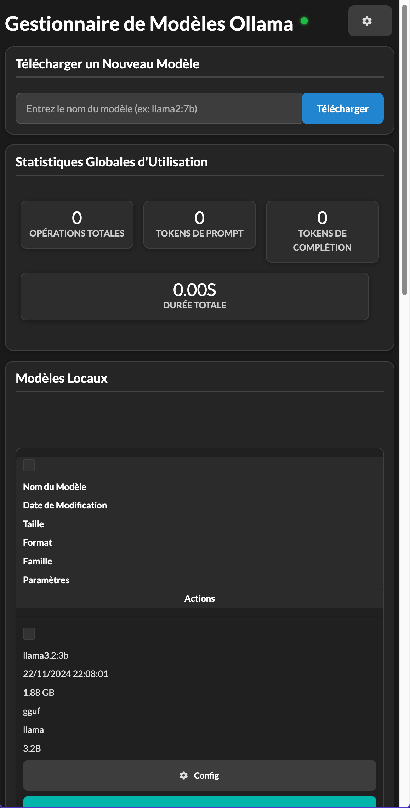

# Gestionnaire de Modèles Ollama



## Description
Une interface web pour gérer vos modèles Ollama, construite avec Flask et Semantic UI.

## Fonctionnalités
- Gestion des modèles (téléchargement, suppression, configuration)
- Mode sombre/clair
- Interface responsive
- Statistiques d'utilisation des modèles
- Configuration des modèles
- Opérations par lots
- Comparaison de modèles

## Prérequis
- Python 3.8+
- Ollama installé et en cours d'exécution
- pip ou un autre gestionnaire de paquets Python

## Installation
1. Cloner le dépôt
```bash
git clone [URL_du_repo]
cd [nom_du_repo]
```

2. Installer les dépendances
```bash
pip install -r requirements.txt
```

3. Configuration
- Créer un fichier .env et configurer l'URL du serveur Ollama :
```bash
OLLAMA_SERVER_URL=http://localhost:11434
```

4. Lancer l'application
```bash
python main.py
```

L'application sera accessible à l'adresse http://localhost:5000

## Utilisation
- Accédez à l'interface web via votre navigateur
- Utilisez le bouton de thème en haut à gauche pour basculer entre les modes clair et sombre
- Gérez vos modèles via l'interface intuitive
- Consultez les statistiques d'utilisation
- Configurez vos modèles individuellement ou en lot

## Contribution
Les contributions sont les bienvenues ! N'hésitez pas à ouvrir une issue ou une pull request.

## Licence
MIT
