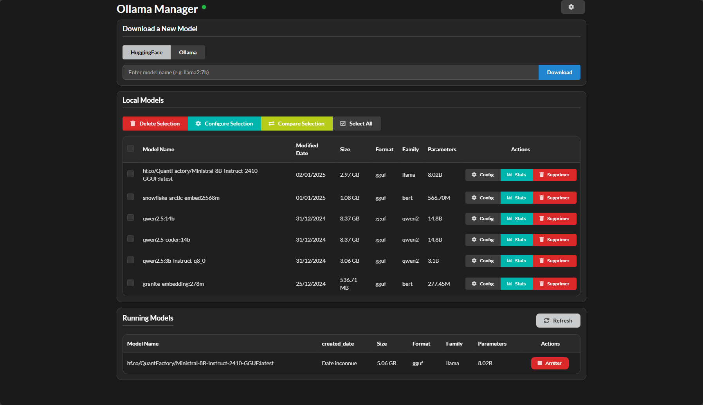

# Ollama Model Manager



## Description
A web interface to manage your Ollama models, built with Flask and Semantic UI.

## Features
- Model management (download, delete, configure)
- Dark/Light mode
- Responsive interface
- Model usage statistics
- Model configuration
- Batch operations
- Model comparison
- Model downloads from Hugging Face and ollama.com
- English and French languages

## Requirements
- Python 3.8+
- Ollama installed and running
- pip or another Python package manager

## Installation
1. Clone the repository:
```bash
git clone https://github.com/yblis/OllamaManagerUI.git
cd OllamaManagerUI
```

2. Install dependencies:
```bash
pip install -r requirements.txt
```

3. Configuration:
- Create a .env file and configure the Ollama server URL:
```bash
OLLAMA_SERVER_URL=http://localhost:11434
```

4. Start the application:
```bash
python main.py
```

The application will be accessible at http://localhost:5000

## Usage
- Access the web interface through your browser
- Use the theme button at the top left to switch between light and dark modes
- Manage your models through the intuitive interface
- View usage statistics
- Configure models individually or in batches

## Contribution
Contributions are welcome! Feel free to open an issue or a pull request.

## License
MIT

